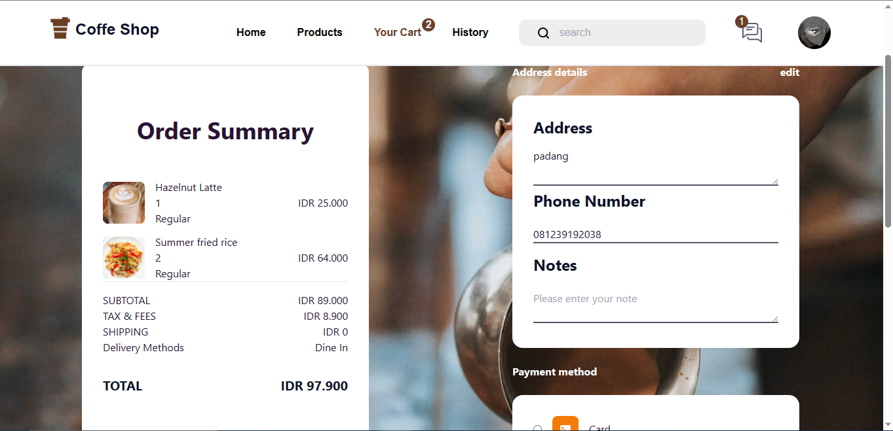

## Readme Top

<div align="center">

<h3 align="center">Coffe Shop</h3>

  <p align="center">
    <a href="https://coffe-shop-fullstack.vercel.app/">View Demo</a>
    ·
    <a href="https://github.com/redhadefinto/coffe_shop_fe/issues">Report Bug</a>
    ·
    <a href="https://github.com/redhadefinto/coffe_shop_fe/pulls">Request Feature</a>
  </p>
</div>

<!-- TABLE OF CONTENTS -->
<details>
  <summary>Table of Contents</summary>
  <ol>
    <li>
      <a href="#about-the-project">About The Project</a>
      <ul>
        <li><a href="#built-with">Built With</a></li>
      </ul>
    </li>
    <li>
      <a href="#getting-started">Getting Started</a>
    </li>
    <li><a href="#usage">Usage</a></li>
    <li><a href="#contact">Contact</a></li>
    <li><a href="#acknowledgments">Acknowledgments</a></li>
    <li><a href="#Documentation">Documentation</a></li>
    <li><a href="#Contributor">Contributor</a></li>
  </ol>
</details>

<!-- ABOUT THE PROJECT -->

## About The Project

<!-- ![Product Name Screen Shot][product-screenshot] -->

"Our coffee shop web application brings the delightful experience of a café to your screen. Discover an extensive menu of coffee and tea specialties, explore personalized recommendations, place orders with ease, and enjoy the convenience of online payment and delivery options. Immerse yourself in a virtual coffee shop ambiance, where you can connect with fellow coffee enthusiasts, learn about the origins of different brews, and stay updated on upcoming events and promotions. Whether you're seeking a quick pick-me-up or a relaxing coffee break, our web application ensures a seamless and enjoyable coffee shop experience from the comfort of your own device."

<p align="right">(<a href="#readme-top">back to top</a>)</p>

### Built With

- [![React][React.js]][React-url]
- [![Tailwind][Tailwind-CSS]][Tailwind-url]
- [![Redux][Redux]][Redux-url]

<p align="right">(<a href="#readme-top">back to top</a>)</p>

## Features

### Customer

- Auth
  - Login
  - Logout
  - Register
  - Forgot Password
- User
  - Edit Profile
- Product
- Promo
- Transaction
- History

<p align="right">(<a href="#readme-top">back to top</a>)</p>
<!-- GETTING STARTED -->

## Getting Started

1. Clone the repo
   ```sh
   https://github.com/redhadefinto/coffe_shop_fe.git
   ```
2. Install NPM packages
   ```sh
   npm install
   ```
3. Run dev local
   ```sh
   npm run dev
   ```
4. Open Browser
   ```sh
   http://localhost:3000
   ```

<p align="right">(<a href="#readme-top">back to top</a>)</p>

<!-- CONTACT -->

## ENV

```sh
  REACT_APP_SERVER_HOST
```

## Contact

Redha Definto - redhadefinto28@gmail.com

Project Link: [https://github.com/redhadefinto/coffe_shop_fe](https://github.com/redhadefinto/coffe_shop_fe)

<p align="right">(<a href="#readme-top">back to top</a>)</p>

<!-- ACKNOWLEDGMENTS -->

## Acknowledgments

- [React](https://reactjs.org/)
- [Tailwind](https://tailwindcss.com/)
- [Redux](https://redux.js.org/)

<p align="right">(<a href="#readme-top">back to top</a>)</p>

## Documentation




<p align="right">(<a href="#readme-top">back to top</a>)</p>

<!-- Contributor -->

## Contributor

  <table>
    <tr>
      <td >
        <a href="https://github.com/redhadefinto">
          <br/>
          <center><sub><b>Redha Definto </b></sub></center>
        </a>
        </td>
    </tr>
  </table>
<h1 align="center"> THANK FOR YOUR ATTENTION </h1>

<!-- MARKDOWN LINKS & IMAGES -->
<!-- https://www.markdownguide.org/basic-syntax/#reference-style-links -->

<!-- [product-screenshot]: index.png -->

[Next.js]: https://img.shields.io/badge/next.js-000000?style=for-the-badge&logo=nextdotjs&logoColor=white
[Next-url]: https://nextjs.org/
[React.js]: https://img.shields.io/badge/React-20232A?style=for-the-badge&logo=react&logoColor=61DAFB
[React-url]: https://reactjs.org/
[Tailwind-CSS]: https://img.shields.io/badge/tailwindcss-%2338B2AC.svg?style=for-the-badge&logo=tailwind-css&logoColor=white
[Tailwind-url]: https://tailwindcss.com/
[Redux]: https://img.shields.io/badge/redux-%23593d88.svg?style=for-the-badge&logo=redux&logoColor=white
[Redux-url]: https://redux.js.org/
